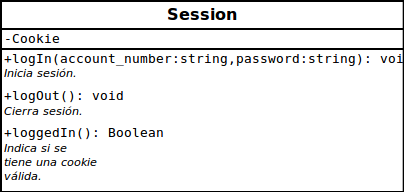
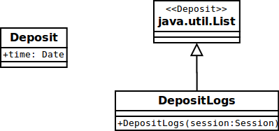
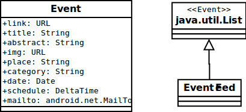

# Modelos

## `Session`
### Una sesión del usuario.

Modelo usado para guardar los datos de la sesión. En cualquier momento debe existir una única instancia de esta clase.

## `Profile`
### Perfil del becario.

## `DepositLogs`
### Historial de depósitos.

## `EventFeed`
### Programa de eventos.

